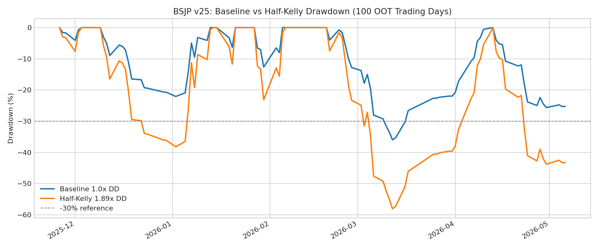
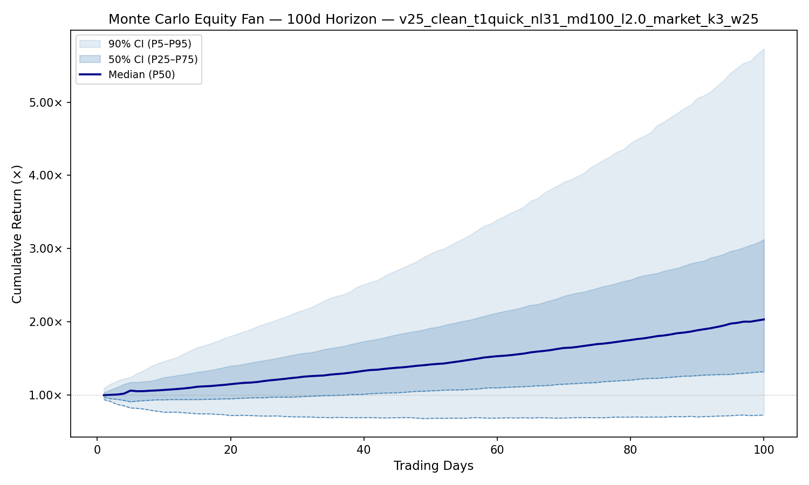
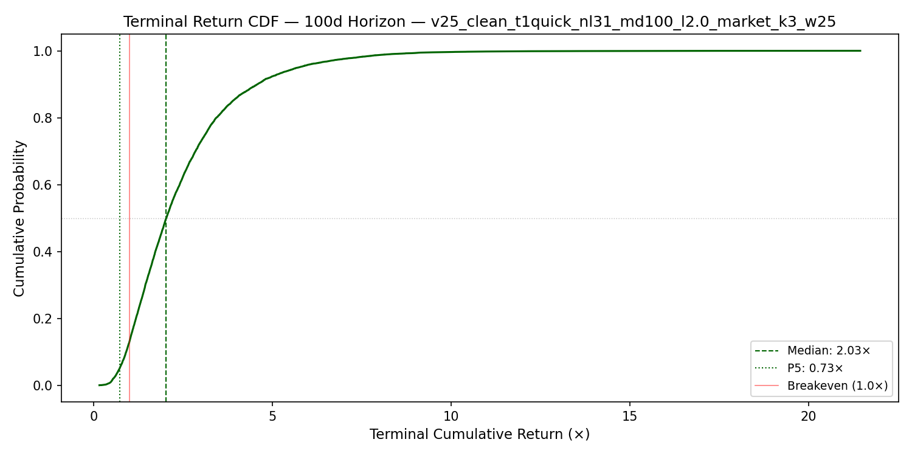
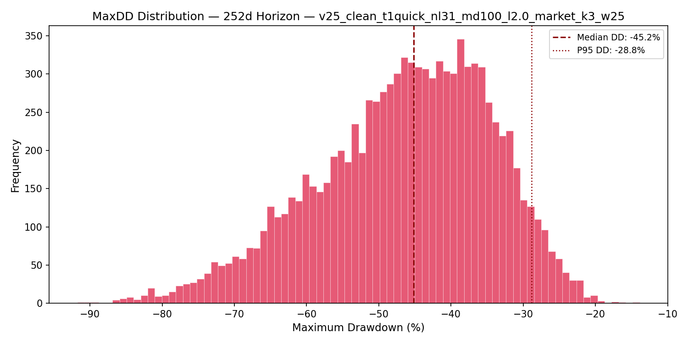

# Strategi Overnight IDX Berbasis Machine Learning Iterasi v25

**Evaluasi Sizing Baseline vs Half-Kelly**  
Tanggal laporan: **21 Mei 2026**  
Model: `v25_clean_t1quick_nl31_md100_l2.0_market_k3_w25`  
Objective: **close10** - beli menjelang penutupan hari T, jual sekitar sesi pembukaan 10:00 hari T+1  
Audience: trader ritel dan evaluator internal strategi BSJP

---

## 1. Ringkasan Eksekutif

Laporan ini mengevaluasi model BSJP v25 dari sudut pandang **position sizing**, bukan membandingkan dua model yang berbeda. Dua skenario yang diuji adalah:

1. **Baseline**: memakai policy asli model, maksimal 3 saham dengan bobot maksimum 25% per saham.
2. **Half-Kelly**: menaikkan exposure baseline sebesar `1.8888x`, berdasarkan estimasi Kelly dari distribusi return harian portofolio OOT.

Hasil pengujian pada **100 trading days OOT** menunjukkan bahwa baseline sudah menghasilkan pertumbuhan modal yang kuat, sementara half-Kelly meningkatkan potensi return secara signifikan tetapi memperbesar drawdown ke level yang jauh lebih berat secara psikologis dan operasional.

| Skenario | Exposure | Return 100D OOT | Max Drawdown | Rp10 juta menjadi | Catatan Utama |
|---|---:|---:|---:|---:|---|
| Baseline | 1.00x | +95.59% | -35.95% | Rp19.56 juta | Masih realistis untuk cash-only |
| Half-Kelly | 1.89x | +197.59% | -58.06% | Rp29.76 juta | Return tinggi, tetapi membutuhkan leverage dan toleransi DD sangat besar |

**Kesimpulan utama:** baseline lebih layak menjadi acuan eksekusi realistis. Half-Kelly berguna sebagai stress test dan batas atas agresivitas sizing, tetapi belum layak menjadi default real-money untuk trader ritel karena implied gross exposure mencapai sekitar **141.7%**.

---

## 2. Latar Belakang Institusional

Strategi BSJP (Beli Sore Jual Pagi) tidak lahir dari kekosongan ide. Konsep dasar strategi ini berakar pada temuan riset pasar yang mengidentifikasi adanya alpha pada strategi holding overnight di Bursa Efek Indonesia (BEI). Pencarian edge ini pada awalnya tercetus oleh paper penelitian dari Mandiri Sekuritas Research Team yang mengkaji fenomena tersebut secara mendalam.

### 2.1 Temuan Riset Mandiri Sekuritas

Penelitian kunci yang menjadi landasan adalah paper berjudul **"Is Holding Overnight Produce Alpha Compared to Intraday Holding? Case Study in IDX"** yang ditulis oleh Rahmanto Tyas Raharja. Riset ini secara spesifik menganalisis perbandingan performa antara strategi memegang saham saat pasar tutup (overnight) versus memegang saham saat pasar buka (intraday).

Temuan utama dari paper tersebut menyimpulkan bahwa strategi **Overnight Holding**, yaitu membeli pada harga penutupan dan menjual pada pembukaan hari berikutnya, secara konsisten menghasilkan return yang lebih unggul dibandingkan strategi **Intraday Holding** maupun strategi **Buy and Hold** pasif.

### 2.2 Bukti Empiris Data IHSG dan R-LQ45X

Data empiris yang dikutip dalam riset tersebut, mencakup periode 2013-2021, menunjukkan divergensi yang tajam antara kedua strategi:

| Strategi | Interpretasi Hasil |
|---|---|
| Overnight Holding | Kurva akumulasi return menunjukkan tren positif yang curam, mengindikasikan bahwa mayoritas pergerakan harga positif di pasar Indonesia terjadi di luar jam perdagangan reguler, yaitu antara close hari T dan open hari T+1. |
| Intraday Holding | Kurva akumulasi return cenderung stagnan atau fluktuatif tanpa pertumbuhan yang berarti, menandakan bahwa berada di pasar selama jam perdagangan utama tidak memberikan premi return yang signifikan. |

### 2.3 Faktor Penyebab Edge Overnight

Mandiri Sekuritas mengidentifikasi beberapa faktor yang dapat menjelaskan fenomena ini:

1. **Risk Premium Overnight**: adanya kompensasi risiko bagi investor yang menahan posisi saat pasar tutup, mengingat potensi berita eksternal yang dapat memicu volatilitas saat pembukaan.
2. **Regulasi Pasar Indonesia**: struktur regulasi dan mekanisme perdagangan di IDX dapat mempengaruhi dinamika volatilitas pembukaan.
3. **Likuiditas ETF**: dinamika likuiditas pada instrumen ETF seperti R-LQ45X dapat menciptakan gap harga yang produktif.
4. **Pembatasan Pre-Market Trading**: keterbatasan aktivitas pra-pembukaan menyebabkan akumulasi order dieksekusi secara serentak pada jam buka.

Strategi BSJP v25 merupakan upaya untuk mengoperasionalkan temuan institusional ini ke dalam kerangka kerja kuantitatif yang terukur. Perbedaannya, BSJP v25 menambahkan lapisan seleksi saham berbasis machine learning untuk mengoptimalkan pemilihan emiten, bukan sekadar memegang indeks secara pasif.

---

## 3. Konteks Strategi

BSJP adalah strategi **Beli Sore Jual Pagi**. Model memilih saham menjelang penutupan pasar, lalu posisi dijual pada sesi pembukaan hari bursa berikutnya.

| Komponen | Deskripsi |
|---|---|
| Universe | Saham IDX, terutama saham aktif yang lolos filter harga dan biaya |
| Entry | Close sekitar jam 15 pada hari T |
| Exit | Open sekitar jam 10 pada hari T+1 |
| Maksimal posisi | 3 saham |
| Bobot baseline | Maksimum 25% per saham |
| Biaya asumsi | Roundtrip sekitar 0.40% |
| OOT window | 26 November 2025 - 6 Mei 2026 |
| Jumlah hari OOT | 100 trading days |

Model v25 ini bukan model pemburu ARA murni. Feature importance menunjukkan bahwa sinyal dominan berasal dari struktur intraday sebelum keputusan entry, terutama biaya/spread relatif, range harga, VWAP, dan turnover sesi siang.

| Rank | Feature | Interpretasi Operasional |
|---:|---|---|
| 1 | `pre14_tick_pct` | Estimasi friksi harga relatif terhadap harga saham |
| 2 | `pre14_range_pct` | Aktivitas dan volatilitas harga sebelum sore |
| 3 | `pre14_vwap` | Harga rata-rata berbobot volume sebelum entry |
| 4 | `pre14_spread_cost_est` | Estimasi biaya spread masuk-keluar |
| 5 | `pre14_pm_turnover` | Nilai transaksi sesi siang |

---

## 4. Definisi Sizing

### 4.1 Baseline

Baseline adalah policy asli model:

- maksimal 3 saham per hari,
- bobot maksimum 25% per saham,
- total gross exposure maksimum sekitar 75%,
- tidak membutuhkan leverage jika modal tersedia dalam bentuk cash.

### 4.2 Half-Kelly

Half-Kelly dalam laporan ini dihitung dari **return harian portofolio baseline**, bukan dari probability individual saham. Rumus yang dipakai adalah pendekatan empirical Kelly, yaitu mencari multiplier yang memaksimalkan rata-rata log return:

```text
maximize average(log(1 + f * daily_return))
```

Hasil estimasi:

| Metrik Kelly | Nilai |
|---|---:|
| Approx full Kelly (`mean / variance`) | 3.5678x |
| Empirical full Kelly | 3.7776x |
| Half-Kelly | 1.8888x |
| Worst-day ruin limit historis | 9.4990x |

Implikasi sizing:

| Skenario | Max weight per saham | Gross exposure jika 3 saham |
|---|---:|---:|
| Baseline | 25.00% | 75.00% |
| Half-Kelly literal | 47.22% | 141.66% |

Dengan demikian, half-Kelly literal **bukan cash-only**. Jika strategi dibatasi cash-only, scaling yang lebih realistis adalah sekitar `1.333x` dari baseline, karena `75% x 1.333 ~= 100%`.

---

## 5. Hasil Historis OOT: Baseline vs Half-Kelly

### 5.1 Equity Curve

Grafik berikut menunjukkan pertumbuhan modal pada 100 trading days OOT. Baseline menghasilkan pertumbuhan yang kuat dengan drawdown besar tetapi masih dalam batas yang relatif dapat diterima untuk strategi high-growth. Half-Kelly menghasilkan pertumbuhan lebih tinggi, tetapi jalurnya jauh lebih volatile.


| Metrik | Baseline | Half-Kelly |
|---|---:|---:|
| Cumulative return | +95.59% | +197.59% |
| Final capital dari Rp10 juta | Rp19.56 juta | Rp29.76 juta |
| Annualized return | +442.23% | +1,461.45% |
| Sharpe annualized | 2.65 | 2.65 |
| Win days | 50 / 100 | 50 / 100 |
| Best day | +13.61% | +25.71% |
| Worst day | -10.53% | -19.88% |

Sharpe ratio sama karena half-Kelly hanya menskalakan return baseline. Return dan volatilitas naik proporsional. Karena itu, Sharpe tidak boleh dibaca sebagai bukti bahwa half-Kelly lebih aman.

### 5.2 Drawdown



| Metrik Risiko | Baseline | Half-Kelly |
|---|---:|---:|
| Max drawdown | -35.95% | -58.06% |
| Ulcer Index | 15.06% | 26.22% |
| Calmar Ratio | 12.30 | 25.17 |

Baseline mengalami drawdown maksimum sekitar -36%. Untuk strategi IDX second-liner dengan target return tinggi, level ini masih dapat dipertimbangkan. Half-Kelly mengalami drawdown maksimum sekitar -58%, yang secara praktis hanya cocok untuk modal yang benar-benar dingin dan trader dengan toleransi tekanan sangat tinggi.

---

## 6. Performa Rolling Window

Analisis rolling window membantu melihat pengalaman investor jika mulai masuk di fase yang berbeda. Periode terakhir OOT menunjukkan bahwa model sempat mengalami fase pendek yang buruk, terutama pada window 14 hari terakhir.

| Window Terakhir | Baseline Return | Baseline MaxDD | Half-Kelly Return | Half-Kelly MaxDD |
|---:|---:|---:|---:|---:|
| 7 trading days | -1.88% | -4.19% | -3.72% | -7.84% |
| 14 trading days | -22.13% | -21.54% | -38.57% | -37.68% |
| 30 trading days | +22.31% | -25.64% | +40.86% | -43.77% |
| 90 trading days | +49.78% | -35.95% | +83.37% | -58.06% |
| 100 trading days | +95.59% | -35.95% | +197.59% | -58.06% |

Interpretasi:

- Window 14 hari terakhir adalah fase stress yang penting. Baseline turun -22.13%, half-Kelly turun -38.57%.
- Window 30 hari tetap positif, tetapi perjalanan tidak mulus.
- Half-Kelly meningkatkan return saat model bekerja, tetapi memperbesar kerugian secara tajam saat model masuk fase buruk.

Data detail window 30 hari tersedia di:

```text
kelly_baseline_vs_half_30d.csv
```

---

## 7. Monte Carlo dan Stress Test

Monte Carlo dilakukan dengan block bootstrap dari return harian OOT. Simulasi ini tidak memprediksi masa depan secara presisi, tetapi memberi gambaran distribusi kemungkinan jika pola return historis berulang dalam urutan yang berbeda.

### 7.1 Ringkasan Monte Carlo Baseline vs Half-Kelly

| Horizon | Skenario | Median Return | P5 Return | Probabilitas Akhir Rugi | Median MaxDD | Prob. MaxDD <= -30% | Prob. MaxDD <= -50% |
|---:|---|---:|---:|---:|---:|---:|---:|
| 100D | Baseline | +102.05% | -28.98% | 13.25% | -33.36% | 61.98% | 11.56% |
| 100D | Half-Kelly | +213.84% | -53.47% | 16.80% | -55.16% | 97.19% | 62.63% |
| 252D | Baseline | +493.50% | +17.11% | 3.43% | -44.58% | 92.52% | 34.33% |
| 252D | Half-Kelly | +1,728.07% | -8.96% | 5.61% | -69.72% | 99.99% | 93.61% |

Kesimpulan Monte Carlo:

- Baseline masih memiliki risiko drawdown besar, tetapi probabilitas akhir rugi lebih terkendali.
- Half-Kelly memberi upside yang ekstrem, namun hampir seluruh simulasi mengalami drawdown lebih dari -30%.
- Pada horizon 252 hari, half-Kelly memiliki probabilitas drawdown lebih dari -50% sebesar 93.61%. Ini menjadikannya tidak cocok sebagai default untuk trader ritel.

### 7.2 Visual Monte Carlo

**Fan Chart 100 Hari**



**Fan Chart 252 Hari**


**Return Distribution 100 Hari**



**Return Distribution 252 Hari**


**Max Drawdown Histogram 100 Hari**


**Max Drawdown Histogram 252 Hari**



---

## 8. Visual PnL Baseline

Grafik berikut adalah artifact PnL baseline yang dihasilkan saat training. Grafik ini membantu membaca kondisi performa model pada horizon pendek, menengah, dan penuh OOT.

**PnL 20 Trading Days**


**PnL 50 Trading Days**


**PnL 100 Trading Days**


---

## 9. Penilaian Risiko

### 9.1 Risiko Drawdown

Baseline memiliki MaxDD -35.95%. Dalam konteks strategi agresif yang menargetkan saham IDX dengan pergerakan cepat, drawdown ini masih dapat dipertimbangkan. Namun, investor harus menerima bahwa fase rugi besar tetap mungkin terjadi.

Half-Kelly memiliki MaxDD -58.06%. Ini bukan sekadar volatilitas biasa. Pada level ini, banyak trader akan berhenti mengikuti sistem sebelum strategi sempat pulih.

### 9.2 Risiko Leverage

Half-Kelly literal membutuhkan gross exposure sekitar 141.66%. Artinya, strategi harus menggunakan margin atau leverage. Risiko tambahan yang tidak tercermin penuh di backtest:

- biaya margin,
- forced liquidation,
- gagal eksekusi di saham tidak likuid,
- slippage lebih besar saat ukuran order naik,
- disiplin eksekusi yang lebih sulit.

### 9.3 Risiko Lookahead

Audit saat ini tidak menunjukkan bukti lookahead fatal pada model v25 T-1 quick. Namun, risiko ini tetap menjadi area kontrol utama. Aturan yang harus terus dijaga:

- broker features harus T-1,
- exit price tidak boleh jadi feature,
- data intraday harus tersedia sebelum jam keputusan,
- feature live harus konsisten dengan feature training.

### 9.4 Risiko Operasional Inference

Backtest yang baik tidak otomatis menjamin sinyal live siap dikirim. Untuk live inference, sistem harus memenuhi syarat berikut:

- data T-1 lengkap,
- data intraday hari T tersedia sampai minimal jam 14/15,
- `entry_price` terisi,
- `pre14_*` terisi,
- model variant sesuai,
- heartbeat tidak berada dalam status blocked.

Pada 21 Mei 2026, bug `entry_price=0` pada jalur inference sudah diperbaiki. Heartbeat juga telah dipisahkan antara kondisi `STANDBY` dan `STALE`, sehingga data hari berjalan sebelum jam 15 tidak lagi salah dibaca sebagai kegagalan.

---

## 10. Rekomendasi Sizing

| Profil Pengguna | Rekomendasi |
|---|---|
| Trader ritel konservatif | Gunakan baseline atau lebih kecil |
| Trader ritel agresif cash-only | Pertimbangkan cap sekitar 33% per saham, total gross mendekati 100% |
| Trader profesional dengan margin | Half-Kelly hanya sebagai batas atas eksperimen, bukan default |
| Paper trading / live validation | Baseline lebih tepat untuk validasi awal |

Rekomendasi utama:

1. Jadikan **baseline** sebagai acuan eksekusi utama.
2. Jangan menjadikan half-Kelly sebagai default real-money sampai ada bukti live yang lebih panjang.
3. Jika ingin meningkatkan sizing, lakukan bertahap: `1.0x -> 1.25x -> 1.33x`, bukan langsung `1.89x`.
4. Ukur ulang Kelly setelah ada live result yang cukup, bukan hanya dari OOT historis.

---

## 11. Keputusan Sementara

Model v25 baseline dapat dipertahankan sebagai kandidat strategi BSJP yang agresif tetapi masih realistis. Half-Kelly menunjukkan potensi return yang jauh lebih besar, namun profil risikonya terlalu ekstrem untuk dijadikan default.

Keputusan sementara:

| Area | Status |
|---|---|
| Baseline research result | Layak dipertahankan |
| Half-Kelly as default sizing | Tidak direkomendasikan |
| Half-Kelly as stress test | Berguna |
| Live inference | Perlu monitoring harian, bug entry price sudah diperbaiki |
| Report/PnL recency | Perlu refresh L1/L2 untuk memperpanjang artifact setelah 6 Mei 2026 |

---

## 12. Artifact Register

### Data dan Metrik

| File | Keterangan |
|---|---|
| `metrics.json` | Metrik training, OOT, policy, dan metadata model |
| `feature_importance.csv` | Feature importance LightGBM |
| `walkforward_metrics.csv` | Ringkasan walk-forward validation |
| `portfolio_daily.parquet` | Return harian portofolio baseline |
| `valid_predictions.parquet` | Prediksi valid/OOT per saham |
| `kelly_baseline_vs_half_metrics.json` | Metrik sizing baseline dan half-Kelly |
| `kelly_baseline_vs_half_30d.csv` | Detail window 30 hari terakhir |
| `kelly_baseline_vs_half_monte_carlo.csv` | Monte Carlo baseline vs half-Kelly |

### Visual

| File | Keterangan |
|---|---|
| `kelly_baseline_vs_half_equity_100d.png` | Equity curve baseline vs half-Kelly |
| `kelly_baseline_vs_half_drawdown_100d.png` | Drawdown baseline vs half-Kelly |
| `pnl_20d.png` | PnL baseline 20 hari |
| `pnl_50d.png` | PnL baseline 50 hari |
| `pnl_100d.png` | PnL baseline 100 hari |
| `monte_carlo/monte_equity_fan_100d.png` | Monte Carlo fan chart 100 hari |
| `monte_carlo/monte_equity_fan_252d.png` | Monte Carlo fan chart 252 hari |
| `monte_carlo/monte_return_cdf_100d.png` | Distribusi return Monte Carlo 100 hari |
| `monte_carlo/monte_return_cdf_252d.png` | Distribusi return Monte Carlo 252 hari |
| `monte_carlo/monte_maxdd_hist_100d.png` | Histogram MaxDD Monte Carlo 100 hari |
| `monte_carlo/monte_maxdd_hist_252d.png` | Histogram MaxDD Monte Carlo 252 hari |
---

## 13. Lampiran A - Daftar Pick OOT 100 Hari

Tabel ini menampilkan posisi baseline yang digunakan dalam simulasi OOT 100 hari. Pick sudah mengikuti filter eksekusi backtest: harga minimum, estimasi biaya pasar maksimum, adaptive threshold, dan batas maksimum 3 posisi per hari.

Keterangan: `Tanggal Entry` adalah hari sinyal dan pembelian sore T. `Tanggal Exit/Realisasi` adalah hari jual pagi T+1, yaitu saat PnL overnight baru diketahui. `@ entry->exit` memakai harga entry sore T dan exit pagi T+1. Angka dalam kurung adalah return bruto per emiten dan probabilitas model. `Overnight Net` adalah return portofolio setelah biaya sesuai `portfolio_daily.parquet`, direalisasikan pada tanggal exit.

| Tanggal Entry | Tanggal Exit/Realisasi | Pick 1 | Pick 2 | Pick 3 | Overnight Net | Equity Setelah Exit |
|---|---|---|---|---|---:|---:|
| 2025-11-26 | 2025-11-27 | SSTM @ 1690->1815 (+7.40%, p=36.73%) | FUTR @ 655->710 (+8.40%, p=36.70%) | INET @ 705->675 (-4.26%, p=36.70%) | +1.28% | Rp10.13m |
| 2025-11-27 | 2025-11-28 | FUTR @ 690->675 (-2.17%, p=36.70%) | INET @ 625->635 (+1.60%, p=36.70%) | KETR @ 580->595 (+2.59%, p=36.70%) | -1.58% | Rp9.97m |
| 2025-11-28 | 2025-12-01 | INKP @ 8775->8600 (-1.99%, p=36.85%) | RMKE @ 3810->3930 (+3.15%, p=36.78%) | INET @ 655->675 (+3.05%, p=36.70%) | -0.15% | Rp9.95m |
| 2025-12-01 | 2025-12-02 | ENRG @ 1195->1145 (-4.18%, p=36.78%) | TALF @ 585->585 (+0.00%, p=36.73%) | INDY @ 2070->2010 (-2.90%, p=36.70%) | -2.41% | Rp9.71m |
| 2025-12-02 | 2025-12-03 | YPAS @ 590->735 (+24.58%, p=37.01%) | SSTM @ 1665->1615 (-3.00%, p=36.73%) | CBRE @ 1055->1035 (-1.90%, p=36.70%) | +3.46% | Rp10.05m |
| 2025-12-03 | 2025-12-04 | ROCK @ 1325->1655 (+24.91%, p=37.46%) | YPAS @ 735->915 (+24.49%, p=37.35%) | ENRG @ 1165->1185 (+1.72%, p=36.70%) | +11.44% | Rp11.20m |
| 2025-12-04 | 2025-12-05 | PJAA @ 690->650 (-5.80%, p=37.58%) | BUKK @ 2060->2470 (+19.90%, p=37.58%) | GHON @ 1985->1815 (-8.56%, p=36.73%) | -0.01% | Rp11.20m |
| 2025-12-05 | 2025-12-08 | KETR @ 775->965 (+24.52%, p=36.85%) | ENRG @ 1200->1370 (+14.17%, p=36.63%) | MDKA @ 2240->2250 (+0.45%, p=36.63%) | +8.42% | Rp12.14m |
| 2025-12-08 | 2025-12-09 | FAST @ 615->695 (+13.01%, p=37.62%) | TEBE @ 2500->2700 (+8.00%, p=37.62%) | PGUN @ 10900->12325 (+13.07%, p=37.58%) | +7.25% | Rp13.02m |
| 2025-12-09 | 2025-12-10 | KETR @ 1205->1375 (+14.11%, p=37.62%) | YPAS @ 775->810 (+4.52%, p=37.35%) | SSTM @ 1675->1470 (-12.24%, p=36.73%) | +0.29% | Rp13.06m |
| 2025-12-10 | 2025-12-11 | MORA @ 14050->16225 (+15.48%, p=37.62%) | KETR @ 1495->1275 (-14.72%, p=36.85%) | ALII @ 730->725 (-0.68%, p=36.70%) | -3.06% | Rp12.66m |
| 2025-12-11 | 2025-12-12 | BRMS @ 980->1135 (+15.82%, p=36.70%) | FUTR @ 745->720 (-3.36%, p=36.70%) | MDKA @ 2180->2230 (+2.29%, p=36.70%) | -2.07% | Rp12.40m |
| 2025-12-12 | 2025-12-15 | FORU @ 1565->1405 (-10.22%, p=36.77%) | BRMS @ 1230->1235 (+0.41%, p=36.70%) | DEWA @ 605->580 (-4.13%, p=36.70%) | -4.10% | Rp11.89m |
| 2025-12-15 | 2025-12-16 | KONI @ 2850->3400 (+19.30%, p=37.35%) | ARTO @ 2210->2100 (-4.98%, p=36.70%) | BBTN @ 1170->1145 (-2.14%, p=36.70%) | +3.67% | Rp12.33m |
| 2025-12-16 | 2025-12-17 | CBRE @ 1170->1190 (+1.71%, p=36.70%) | CUAN @ 2410->2400 (-0.41%, p=36.70%) | FUTR @ 750->745 (-0.67%, p=36.70%) | -0.39% | Rp12.28m |
| 2025-12-17 | 2025-12-18 | BRMS @ 1140->1130 (-0.88%, p=36.70%) | FPNI @ 1055->1015 (-3.79%, p=36.70%) | INDY @ 2290->2290 (+0.00%, p=36.70%) | -1.26% | Rp12.12m |
| 2025-12-18 | 2025-12-19 | KETR @ 1105->980 (-11.31%, p=36.70%) | RAJA @ 5800->5725 (-1.29%, p=36.70%) | BRMS @ 1125->1120 (-0.44%, p=36.63%) | -4.47% | Rp11.58m |
| 2025-12-19 | 2025-12-22 | TALF @ 625->555 (-11.20%, p=36.73%) | FUTR @ 665->695 (+4.51%, p=36.70%) | NCKL @ 1020->1045 (+2.45%, p=36.70%) | -5.82% | Rp10.91m |
| 2025-12-22 | 2025-12-23 | EMTK @ 1145->1135 (-0.87%, p=36.70%) | ESSA @ 645->625 (-3.10%, p=36.70%) | INDY @ 2300->2390 (+3.91%, p=36.70%) | -0.28% | Rp10.88m |
| 2025-12-23 | 2025-12-24 | DEWA @ 585->575 (-1.71%, p=36.70%) | HRUM @ 1060->1070 (+0.94%, p=36.70%) | INET @ 855->805 (-5.85%, p=36.70%) | -3.08% | Rp10.54m |
| 2025-12-24 | 2025-12-25 | INCO @ 5075->5075 (+0.00%, p=36.70%) | EMTK @ 1085->1110 (+2.30%, p=36.63%) | RAJA @ 5825->6000 (+3.00%, p=36.63%) | -0.19% | Rp10.52m |
| 2025-12-29 | 2025-12-30 | TRIN @ 1050->1040 (-0.95%, p=36.89%) | BRMS @ 1145->1105 (-3.49%, p=36.70%) | DEWA @ 680->705 (+3.68%, p=36.70%) | -1.48% | Rp10.37m |
| 2025-12-30 | 2025-12-31 | UDNG @ 5200->5550 (+6.73%, p=37.58%) | CUAN @ 2360->2300 (-2.54%, p=36.70%) | DEWA @ 670->725 (+8.21%, p=36.70%) | -0.13% | Rp10.35m |
| 2026-01-02 | 2026-01-05 | BULL @ 505->520 (+2.97%, p=36.70%) | DEWA @ 750->770 (+2.67%, p=36.70%) | INET @ 770->590 (-23.38%, p=36.70%) | -1.70% | Rp10.18m |
| 2026-01-05 | 2026-01-06 | INET @ 590->680 (+15.25%, p=37.62%) | BANK @ 1060->1020 (-3.77%, p=36.77%) | CMNT @ 840->850 (+1.19%, p=36.70%) | +1.47% | Rp10.33m |
| 2026-01-06 | 2026-01-07 | BSIM @ 1130->1410 (+24.78%, p=37.58%) | PACK @ 2480->2720 (+9.68%, p=37.58%) | ARKO @ 9200->9575 (+4.08%, p=36.78%) | +8.61% | Rp11.22m |
| 2026-01-07 | 2026-01-08 | BSIM @ 1410->1630 (+15.60%, p=37.58%) | IFSH @ 1160->1425 (+22.84%, p=37.58%) | ASLI @ 675->740 (+9.63%, p=36.89%) | +10.65% | Rp12.41m |
| 2026-01-08 | 2026-01-09 | IFSH @ 1450->1245 (-14.14%, p=37.58%) | ADRO @ 2030->2100 (+3.45%, p=36.70%) | DATA @ 5450->5575 (+2.29%, p=36.70%) | -4.73% | Rp11.82m |
| 2026-01-09 | 2026-01-12 | CTBN @ 5800->6800 (+17.24%, p=37.24%) | ASLI @ 685->660 (-3.65%, p=36.70%) | BULL @ 610->615 (+0.82%, p=36.70%) | +6.94% | Rp12.64m |
| 2026-01-12 | 2026-01-13 | ADRO @ 2130->2190 (+2.82%, p=36.70%) | BULL @ 570->575 (+0.88%, p=36.70%) | DATA @ 5625->5575 (-0.89%, p=36.70%) | -0.96% | Rp12.52m |
| 2026-01-13 | 2026-01-14 | SOHO @ 2570->3210 (+24.90%, p=37.58%) | SRTG @ 1865->1830 (-1.88%, p=36.78%) | ADMR @ 2020->2020 (+0.00%, p=36.70%) | +5.72% | Rp13.24m |
| 2026-01-14 | 2026-01-15 | ROCK @ 1735->2160 (+24.50%, p=37.58%) | SSTM @ 2960->3700 (+25.00%, p=37.58%) | UDNG @ 3560->3880 (+8.99%, p=37.58%) | +13.61% | Rp15.04m |
| 2026-01-15 | 2026-01-16 | YPAS @ 680->685 (+0.74%, p=37.35%) | ASLI @ 680->665 (-2.21%, p=36.70%) | BULL @ 635->605 (-4.72%, p=36.70%) | +0.74% | Rp15.15m |
| 2026-01-19 | 2026-01-20 | ROCK @ 2700->2430 (-10.00%, p=37.46%) | BULL @ 630->635 (+0.79%, p=36.70%) | CBRE @ 995->995 (+0.00%, p=36.70%) | -3.26% | Rp14.66m |
| 2026-01-20 | 2026-01-21 | KEEN @ 1285->1230 (-4.28%, p=36.78%) | ASLI @ 645->610 (-5.43%, p=36.70%) | BULL @ 680->650 (-4.41%, p=36.70%) | -3.14% | Rp14.20m |
| 2026-01-21 | 2026-01-22 | UANG @ 6250->7500 (+20.00%, p=37.62%) | RMKO @ 1110->1385 (+24.77%, p=37.46%) | ARCI @ 2030->1955 (-3.69%, p=36.70%) | +11.11% | Rp15.77m |
| 2026-01-22 | 2026-01-23 | AIMS @ 815->930 (+14.11%, p=37.62%) | LPCK @ 815->1015 (+24.54%, p=37.58%) | SGER @ 620->665 (+7.26%, p=36.89%) | +9.75% | Rp17.31m |
| 2026-01-23 | 2026-01-26 | ADMR @ 2280->2290 (+0.44%, p=36.70%) | ADRO @ 2370->2410 (+1.69%, p=36.70%) | DEWA @ 690->715 (+3.62%, p=36.70%) | +0.93% | Rp17.47m |
| 2026-01-26 | 2026-01-27 | ALKA @ 630->785 (+24.60%, p=37.58%) | ELPI @ 1035->980 (-5.31%, p=36.77%) | ARCI @ 2030->1990 (-1.97%, p=36.70%) | +2.68% | Rp17.94m |
| 2026-01-27 | 2026-01-28 | BOGA @ 1435->1615 (+12.54%, p=37.35%) | ADRO @ 2280->2230 (-2.19%, p=36.70%) | CMRY @ 5600->5475 (-2.23%, p=36.70%) | +1.03% | Rp18.13m |
| 2026-01-28 | 2026-01-29 | RDTX @ 16000->14500 (-9.38%, p=37.23%) | DCII @ 205000->187725 (-8.43%, p=36.73%) | ADMR @ 2110->1770 (-16.11%, p=36.70%) | -6.55% | Rp16.94m |
| 2026-01-29 | 2026-01-30 | ESSA @ 665->670 (+0.75%, p=36.89%) | ITMA @ 2110->2150 (+1.90%, p=36.89%) | PTBA @ 2440->2470 (+1.23%, p=36.89%) | -0.55% | Rp16.85m |
| 2026-01-30 | 2026-02-02 | MTMH @ 1045->1035 (-0.96%, p=37.01%) | TALF @ 635->605 (-4.72%, p=36.73%) | BRMS @ 1060->935 (-11.79%, p=36.70%) | -6.01% | Rp15.83m |
| 2026-02-03 | 2026-02-04 | SOHO @ 2800->3410 (+21.79%, p=37.58%) | UDNG @ 2770->2980 (+7.58%, p=37.58%) | TPIA @ 6450->6625 (+2.71%, p=36.78%) | +7.02% | Rp16.94m |
| 2026-02-04 | 2026-02-05 | BRIS @ 2400->2400 (+0.00%, p=36.70%) | BRMS @ 1000->980 (-2.00%, p=36.70%) | BRPT @ 2110->2130 (+0.95%, p=36.70%) | -1.61% | Rp16.67m |
| 2026-02-05 | 2026-02-06 | BUKK @ 1650->2060 (+24.85%, p=37.58%) | FITT @ 665->800 (+20.30%, p=36.73%) | BUVA @ 1030->985 (-4.37%, p=36.70%) | +8.71% | Rp18.12m |
| 2026-02-06 | 2026-02-09 | BRMS @ 925->965 (+4.32%, p=36.70%) | BUVA @ 920->1005 (+9.24%, p=36.70%) | CDIA @ 1025->1030 (+0.49%, p=36.70%) | +2.06% | Rp18.50m |
| 2026-02-09 | 2026-02-10 | PGUN @ 9700->11400 (+17.53%, p=37.58%) | RMKE @ 4160->4300 (+3.37%, p=36.78%) | BRMS @ 1005->1045 (+3.98%, p=36.70%) | +5.26% | Rp19.47m |
| 2026-02-10 | 2026-02-11 | FPNI @ 650->685 (+5.38%, p=37.58%) | LINK @ 2830->2800 (-1.06%, p=37.58%) | PGUN @ 11625->12675 (+9.03%, p=37.58%) | +2.11% | Rp19.88m |
| 2026-02-11 | 2026-02-12 | MAPI @ 1330->1295 (-2.63%, p=36.78%) | BRMS @ 1090->1080 (-0.92%, p=36.70%) | BRPT @ 2280->2250 (-1.32%, p=36.70%) | +1.42% | Rp20.16m |
| 2026-02-12 | 2026-02-13 | LUCY @ 1735->1905 (+9.80%, p=37.58%) | ROCK @ 2420->3020 (+24.79%, p=37.46%) | YPAS @ 680->665 (-2.21%, p=36.94%) | +6.75% | Rp21.52m |
| 2026-02-13 | 2026-02-16 | DEWA @ 625->640 (+2.40%, p=36.70%) | IMPC @ 2280->2410 (+5.70%, p=36.70%) | VKTR @ 960->1005 (+4.69%, p=36.70%) | +1.60% | Rp21.87m |
| 2026-02-18 | 2026-02-19 | RMKO @ 810->1010 (+24.69%, p=37.58%) | LUCY @ 2090->2290 (+9.57%, p=37.58%) | UDNG @ 3590->3730 (+3.90%, p=36.73%) | +8.27% | Rp23.68m |
| 2026-02-19 | 2026-02-20 | MGLV @ 3750->4120 (+9.87%, p=37.58%) | ARKO @ 9000->10100 (+12.22%, p=36.85%) | ADMR @ 2030->2020 (-0.49%, p=36.70%) | +4.41% | Rp24.72m |
| 2026-02-20 | 2026-02-23 | TALF @ 760->710 (-6.58%, p=36.73%) | BFIN @ 770->760 (-1.30%, p=36.70%) | NOBU @ 675->675 (+0.00%, p=36.70%) | -3.98% | Rp23.74m |
| 2026-02-23 | 2026-02-24 | MEGA @ 2065->2575 (+24.70%, p=37.58%) | BRPT @ 2140->2100 (-1.87%, p=36.70%) | ESSA @ 665->645 (-3.01%, p=36.70%) | +3.37% | Rp24.54m |
| 2026-02-24 | 2026-02-25 | BRMS @ 1010->995 (-1.49%, p=36.70%) | BRPT @ 2040->2030 (-0.49%, p=36.70%) | CBDK @ 5950->5850 (-1.68%, p=36.70%) | -0.90% | Rp24.32m |
| 2026-02-25 | 2026-02-26 | KONI @ 2250->2000 (-11.11%, p=37.35%) | BRPT @ 2040->2030 (-0.49%, p=36.70%) | IRSX @ 625->635 (+1.60%, p=36.70%) | -4.12% | Rp23.32m |
| 2026-02-26 | 2026-02-27 | IFSH @ 2000->1745 (-12.75%, p=37.58%) | MGLV @ 4040->4040 (+0.00%, p=36.77%) | ADMR @ 2110->2050 (-2.84%, p=36.70%) | -4.58% | Rp22.25m |
| 2026-02-27 | 2026-03-02 | IMPC @ 2150->2110 (-1.86%, p=36.70%) | MBMA @ 850->840 (-1.18%, p=36.70%) | UNVR @ 2380->2290 (-3.78%, p=36.70%) | -3.12% | Rp21.55m |
| 2026-03-02 | 2026-03-03 | CMRY @ 5125->5025 (-1.95%, p=36.70%) | ELSA @ 1000->985 (-1.50%, p=36.70%) | ENRG @ 2200->2250 (+2.27%, p=36.70%) | -1.08% | Rp21.32m |
| 2026-03-03 | 2026-03-04 | RMKO @ 725->690 (-4.83%, p=37.62%) | ADMR @ 2140->1975 (-7.71%, p=36.70%) | BRIS @ 2160->2150 (-0.46%, p=36.70%) | -4.70% | Rp20.32m |
| 2026-03-04 | 2026-03-05 | EURO @ 1560->1715 (+9.94%, p=37.46%) | ADRO @ 2370->2410 (+1.69%, p=36.70%) | BRMS @ 860->870 (+1.16%, p=36.70%) | +3.39% | Rp21.01m |
| 2026-03-05 | 2026-03-06 | ENRG @ 2090->1915 (-8.37%, p=36.70%) | ESSA @ 785->770 (-1.91%, p=36.70%) | PTRO @ 5250->4920 (-6.29%, p=36.70%) | -5.40% | Rp19.88m |
| 2026-03-06 | 2026-03-09 | ALKA @ 660->565 (-14.39%, p=36.73%) | SKBM @ 885->755 (-14.69%, p=36.73%) | BUVA @ 1070->1005 (-6.07%, p=36.70%) | -10.53% | Rp17.78m |
| 2026-03-09 | 2026-03-10 | SHID @ 940->825 (-12.23%, p=37.58%) | BRMS @ 745->805 (+8.05%, p=36.70%) | BUVA @ 1045->1085 (+3.83%, p=36.70%) | -1.65% | Rp17.49m |
| 2026-03-10 | 2026-03-11 | BRMS @ 855->830 (-2.92%, p=36.70%) | ELSA @ 805->790 (-1.86%, p=36.70%) | ESSA @ 735->725 (-1.36%, p=36.70%) | -3.27% | Rp16.92m |
| 2026-03-11 | 2026-03-12 | AMMN @ 5575->5550 (-0.45%, p=36.70%) | BUVA @ 1075->1030 (-4.19%, p=36.70%) | CBRE @ 885->870 (-1.69%, p=36.70%) | -2.89% | Rp16.43m |
| 2026-03-12 | 2026-03-13 | BRIS @ 2210->2170 (-1.81%, p=36.70%) | BUVA @ 1015->975 (-3.94%, p=36.70%) | ELSA @ 750->730 (-2.67%, p=36.70%) | -3.63% | Rp15.83m |
| 2026-03-13 | 2026-03-16 | ROCK @ 2260->2820 (+24.78%, p=37.35%) | BRMS @ 805->720 (-10.56%, p=36.70%) | CUAN @ 1200->1145 (-4.58%, p=36.70%) | +1.00% | Rp15.99m |
| 2026-03-16 | 2026-03-17 | ROCK @ 2820->3470 (+23.05%, p=37.24%) | BRMS @ 675->745 (+10.37%, p=36.70%) | BUVA @ 945->980 (+3.70%, p=36.70%) | +7.82% | Rp17.24m |
| 2026-03-17 | 2026-03-18 | BREN @ 5650->5775 (+2.21%, p=36.70%) | BRMS @ 680->750 (+10.29%, p=36.70%) | BUVA @ 950->1085 (+14.21%, p=36.70%) | +5.26% | Rp18.15m |
| 2026-03-25 | 2026-03-26 | SSTM @ 625->780 (+24.80%, p=37.24%) | SSIA @ 1340->1385 (+3.36%, p=36.77%) | AMMN @ 5050->4980 (-1.39%, p=36.70%) | +5.38% | Rp19.13m |
| 2026-03-26 | 2026-03-27 | SOTS @ 1090->1185 (+8.72%, p=36.77%) | BUVA @ 995->985 (-1.01%, p=36.70%) | EMTK @ 845->830 (-1.78%, p=36.70%) | +0.03% | Rp19.13m |
| 2026-03-27 | 2026-03-30 | SOHO @ 2030->2200 (+8.37%, p=37.58%) | BRMS @ 715->730 (+2.10%, p=36.63%) | HRTA @ 2390->2320 (-2.93%, p=36.63%) | +0.39% | Rp19.21m |
| 2026-03-30 | 2026-03-31 | EURO @ 2230->2440 (+9.42%, p=37.03%) | ADMR @ 2020->2010 (-0.50%, p=36.70%) | CUAN @ 1145->1125 (-1.75%, p=36.70%) | +0.47% | Rp19.30m |
| 2026-03-31 | 2026-04-01 | BRMS @ 725->755 (+4.14%, p=36.70%) | CUAN @ 1070->1135 (+6.07%, p=36.70%) | ESSA @ 715->690 (-3.50%, p=36.70%) | -0.00% | Rp19.30m |
| 2026-04-01 | 2026-04-02 | ALKA @ 725->890 (+22.76%, p=37.46%) | AMMN @ 5175->4960 (-4.15%, p=36.70%) | BUVA @ 1095->1015 (-7.31%, p=36.70%) | +1.50% | Rp19.59m |
| 2026-04-02 | 2026-04-03 | MSIN @ 835->920 (+10.18%, p=37.58%) | LUCY @ 1025->1125 (+9.76%, p=37.46%) | BRMS @ 725->755 (+4.14%, p=36.70%) | +4.43% | Rp20.45m |
| 2026-04-06 | 2026-04-07 | LUCY @ 1125->1235 (+9.78%, p=37.46%) | IFSH @ 2240->2800 (+25.00%, p=37.35%) | BUVA @ 1055->1070 (+1.42%, p=36.70%) | +7.78% | Rp22.04m |
| 2026-04-07 | 2026-04-08 | BUVA @ 1035->1140 (+10.14%, p=36.70%) | CUAN @ 1155->1160 (+0.43%, p=36.70%) | FORE @ 745->750 (+0.67%, p=36.70%) | +1.34% | Rp22.34m |
| 2026-04-08 | 2026-04-09 | SOTS @ 955->1035 (+8.38%, p=37.58%) | ROCK @ 2480->2950 (+18.95%, p=37.35%) | RAJA @ 4250->4260 (+0.24%, p=36.85%) | +5.76% | Rp23.63m |
| 2026-04-09 | 2026-04-10 | BUVA @ 1165->1220 (+4.72%, p=36.70%) | ESSA @ 730->730 (+0.00%, p=36.70%) | RATU @ 5375->5700 (+6.05%, p=36.70%) | +1.34% | Rp23.94m |
| 2026-04-10 | 2026-04-13 | BREN @ 5800->6000 (+3.45%, p=36.70%) | BUVA @ 1170->1195 (+2.14%, p=36.70%) | PTRO @ 5400->5900 (+9.26%, p=36.70%) | +2.66% | Rp24.58m |
| 2026-04-13 | 2026-04-14 | KONI @ 2450->3060 (+24.90%, p=37.46%) | AMMN @ 5425->5650 (+4.15%, p=36.70%) | BRMS @ 880->895 (+1.70%, p=36.70%) | +6.46% | Rp26.17m |
| 2026-04-14 | 2026-04-15 | SSTM @ 755->760 (+0.66%, p=37.46%) | MORA @ 5725->5900 (+3.06%, p=36.85%) | KONI @ 3060->2610 (-14.71%, p=36.73%) | -4.02% | Rp25.12m |
| 2026-04-15 | 2026-04-16 | DSSA @ 3380->3390 (+0.30%, p=36.78%) | BRPT @ 2370->2400 (+1.27%, p=36.70%) | ESSA @ 785->775 (-1.27%, p=36.70%) | -1.24% | Rp24.80m |
| 2026-04-16 | 2026-04-17 | SOTS @ 1215->1285 (+5.76%, p=37.58%) | BFIN @ 905->875 (-3.31%, p=36.85%) | BRMS @ 855->875 (+2.34%, p=36.70%) | -0.26% | Rp24.74m |
| 2026-04-17 | 2026-04-20 | MLPT @ 30300->26375 (-12.95%, p=37.58%) | BFIN @ 880->840 (-4.55%, p=36.70%) | BRMS @ 860->920 (+6.98%, p=36.70%) | -5.60% | Rp23.35m |
| 2026-04-21 | 2026-04-22 | BRPT @ 2300->2300 (+0.00%, p=36.70%) | CDIA @ 1190->1160 (-2.52%, p=36.70%) | ESSA @ 840->850 (+1.19%, p=36.70%) | -1.72% | Rp22.95m |
| 2026-04-22 | 2026-04-23 | BDMN @ 3850->4340 (+12.73%, p=37.62%) | BIKE @ 635->590 (-7.09%, p=37.46%) | SSIA @ 1800->1820 (+1.11%, p=36.78%) | +0.38% | Rp23.04m |
| 2026-04-23 | 2026-04-24 | SKBM @ 800->685 (-14.37%, p=36.77%) | ELSA @ 800->780 (-2.50%, p=36.70%) | ENRG @ 2090->1965 (-5.98%, p=36.70%) | -7.27% | Rp21.36m |
| 2026-04-24 | 2026-04-27 | BRNA @ 790->685 (-13.29%, p=36.73%) | BFIN @ 820->790 (-3.66%, p=36.70%) | BRMS @ 810->820 (+1.23%, p=36.70%) | -6.70% | Rp19.93m |
| 2026-04-27 | 2026-04-28 | IFSH @ 2560->2750 (+7.42%, p=37.58%) | DSNG @ 1860->1780 (-4.30%, p=36.77%) | AMMN @ 5475->5200 (-5.02%, p=36.70%) | -1.50% | Rp19.63m |
| 2026-04-28 | 2026-04-29 | KONI @ 2370->2830 (+19.41%, p=37.58%) | BRPT @ 2020->1995 (-1.24%, p=36.70%) | BUVA @ 1085->1090 (+0.46%, p=36.70%) | +3.44% | Rp20.31m |
| 2026-04-29 | 2026-04-30 | BUVA @ 1075->1040 (-3.26%, p=36.70%) | CDIA @ 1105->1130 (+2.26%, p=36.70%) | IMPC @ 2310->2210 (-4.33%, p=36.70%) | -2.65% | Rp19.77m |
| 2026-04-30 | 2026-05-04 | AMMN @ 5175->5050 (-2.42%, p=36.70%) | BUVA @ 1060->1075 (+1.42%, p=36.70%) | ESSA @ 875->875 (+0.00%, p=36.70%) | -1.57% | Rp19.46m |
| 2026-05-04 | 2026-05-05 | HERO @ 590->590 (+0.00%, p=37.58%) | UDNG @ 1005->1105 (+9.95%, p=37.58%) | AMMN @ 4960->5000 (+0.81%, p=36.70%) | +1.20% | Rp19.69m |
| 2026-05-05 | 2026-05-06 | KONI @ 2980->2940 (-1.34%, p=36.73%) | AMMN @ 5125->5050 (-1.46%, p=36.70%) | BRPT @ 2300->2400 (+4.35%, p=36.70%) | -0.73% | Rp19.55m |
| 2026-05-06 | 2026-05-07 | UNVR @ 1805->1810 (+0.28%, p=36.78%) | BRMS @ 815->835 (+2.45%, p=36.70%) | BRPT @ 2280->2340 (+2.63%, p=36.70%) | +0.05% | Rp19.56m |
